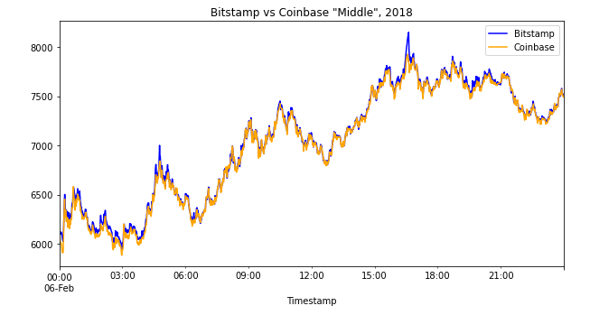

# Module 3 Challenge

FinTech BootCamp Module 3 Challenge: JupyterLab file with example of analysis of arbitrage opportunities between bitstamp and coinbase.

---

## Technologies

Python 3.7.11 with additional libraries:

* [Pandas](https://pandas.pydata.org/pandas-docs/version/0.23/install.html?msclkid=ff9c78b7babb11eca64153f15c95b1cd/) - to analyze data frames using JupyterLabs.

* [JupyterLabs](https://jupyter.org/install?msclkid=31fe502ebabc11ec946b61bf7f54104d/) - to provide workspace for user.

* [Path](https://docs.python.org/3.7/library/pathlib.html?msclkid=8a1725dababc11ecaaddce36ed74fb30/) - import Path from pathlib to read CSV files.

* [IPython.display](https://ipython.readthedocs.io/en/stable/api/generated/IPython.display.html?msclkid=ad07e72cbabc11ecaad9e35a641d5fdb/) - to help output multiple things in each cell.

---

## Installation Guide

Other than Python 3.7, no installation is necessary, Jupyter Labs runs in a browser, including Chrome.  Launch the file by navigating to the directory of the file through a CLI and then running Jupyter labs, with "jupyter lab".

---

## Usage

The worksheet runs through a scenario and allows the user to manipulate arbitrage opportunities between different BTC exchanges.

---

## Contributors

Grigory Timofeev

[E-mail](fintech_github_challenge3@unloca.com)

---

## License

The MIT License (MIT)

Copyright (c) 2022 Grigory Timofeev

Permission is hereby granted, free of charge, to any person obtaining a copy of this software and associated documentation files (the "Software"), to deal in the Software without restriction, including without limitation the rights to use, copy, modify, merge, publish, distribute, sublicense, and/or sell copies of the Software, and to permit persons to whom the Software is furnished to do so, subject to the following conditions:

The above copyright notice and this permission notice shall be included in all copies or substantial portions of the Software.

THE SOFTWARE IS PROVIDED "AS IS", WITHOUT WARRANTY OF ANY KIND, EXPRESS OR IMPLIED, INCLUDING BUT NOT LIMITED TO THE WARRANTIES OF MERCHANTABILITY, FITNESS FOR A PARTICULAR PURPOSE AND NONINFRINGEMENT. IN NO EVENT SHALL THE AUTHORS OR COPYRIGHT HOLDERS BE LIABLE FOR ANY CLAIM, DAMAGES OR OTHER LIABILITY, WHETHER IN AN ACTION OF CONTRACT, TORT OR OTHERWISE, ARISING FROM, OUT OF OR IN CONNECTION WITH THE SOFTWARE OR THE USE OR OTHER DEALINGS IN THE SOFTWARE.